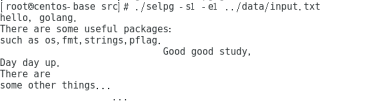
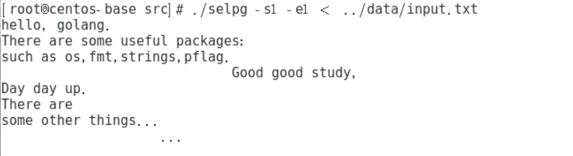
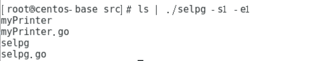
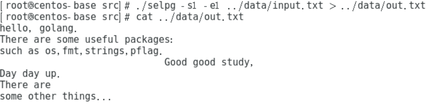
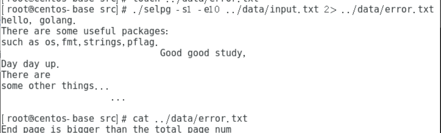
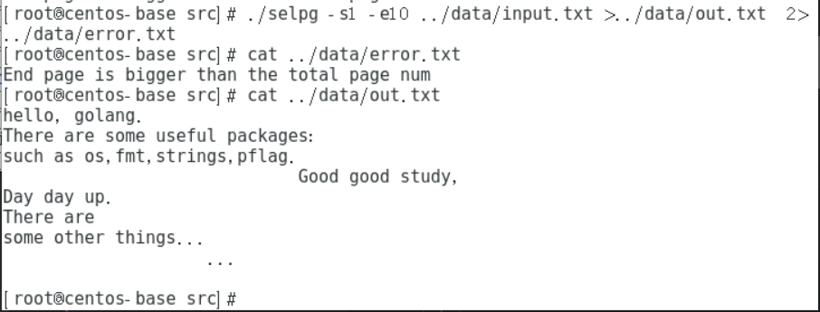
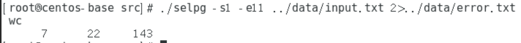
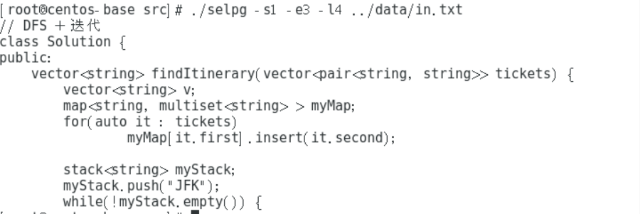
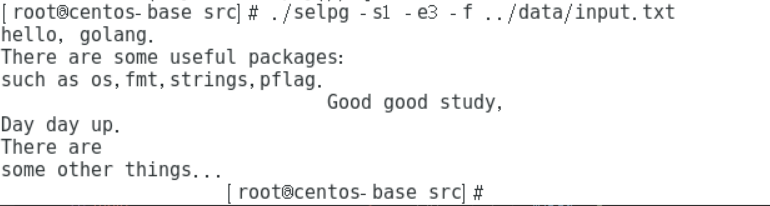
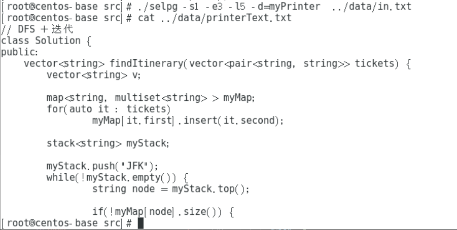

<!-- TOC -->

- [Golang开发Linux命令行实用程序 - selpg](#golang开发linux命令行实用程序---selpg)
  - [1. 介绍](#1-介绍)
  - [2. 设计与实现](#2-设计与实现)
    - [2.1 设计思路](#21-设计思路)
    - [2.2 功能模块划分与实现](#22-功能模块划分与实现)
  - [3 测试](#3-测试)
  - [4 运行](#4-运行)

<!-- /TOC -->

## Golang开发Linux命令行实用程序 -  selpg
### 1. 介绍

* Linux命令行使用程序 - `selpg`，这个名称代表`SELect PaGes`。selpg允许用户指定从输入文本抽取的页的范围，这些输入文本可以来自文件或另一个进程。

### 2. 设计与实现

#### 2.1 设计思路

* 理解`selpg`命令的功能以及处理流程。
* `selpg`命令涉及的基本操作
  * 文件的读写
  * 从终端获取输入以及在终端输出

#### 2.2 功能模块划分与实现

* 构建命令行参数的结构体，由于参数使用的比较多，可以使用一个结构体存储起来，使用起来比较方便

  ```go
  type selpg_args struct {
  	startPage      int
  	endPage        int
  	inFile         string
  	pageLen        int
  	pageType       bool // true for -f, false for -lNumber
  	outDestination string
  }
  ```

* 参数解析

  * 使用pflag包对命令行输入参数进行解析
  * 获得`flag`参数后`pflag.Parse()`函数才能把参数解析出来
  * 使用`pflag.Args()`来获取未被标记的参数

  ```go
  // 解析获取参数
  func getArgs(args *selpg_args) {
    pflag.IntVarP(&(args.startPage), "startPage", "s", -1, "start page")
    pflag.IntVarP(&(args.endPage), "endPage", "e", -1, "end page")
    pflag.IntVarP(&(args.pageLen), "pageLen", "l", 72, "the length of page")
    pflag.BoolVarP(&(args.pageType), "pageType", "f", false, "page type")
    pflag.StringVarP(&(args.outDestination), "outDestination", "d", "", "print destination")
    pflag.Parse()

    other := pflag.Args() // 其余参数
    if len(other) > 0 {
      args.inFile = other[0]
    } else {
      args.inFile = ""
    }
  }
  ```

* 参数检查

  * 检查输入参数的合法性
    * 是否输入了起始页和结束页
    * 起始页大于1小于结束页以及不能溢出（`MaxInt32`）
    * 结束页大于起始页并且不能溢出（`MaxInt32`）
  * 遇到不合法则输出错误同时结束程序

    ```go
    // 检查参数合法性
    func checkArgs(args *selpg_args) {
      if args.startPage == -1 || args.endPage == -1 {
        os.Stderr.Write([]byte("You shouid input like selpg -sNumber -eNumber ... \n"))
        os.Exit(0)
      }

      if args.startPage < 1 || args.startPage > math.MaxInt32 {
        os.Stderr.Write([]byte("You should input valid start page\n"))
        os.Exit(0)
      }

      if args.endPage < 1 || args.endPage > math.MaxInt32 || args.endPage < args.startPage {
        os.Stderr.Write([]byte("You should input valid end page\n"))
        os.Exit(0)
      }

      if (!args.pageType) && (args.pageLen < 1 || args.pageLen > math.MaxInt32) {
        os.Stderr.Write([]byte("You should input valid page length\n"))
        os.Exit(0)
      }
    }
    ```

* 执行命令

  * **`bufio包介绍与使用`**

    * `bufio包`实现了带缓存的 I/O 操作，它封装一个 `io.Reader` 或 `io.Writer` 对象，使其具有缓存和一些文本读写功能

      * `func NewReaderSize(rd io.Reader, size int) *Reader`

        `NewReaderSize` 将` rd` 封装成一个带缓存的 `bufio.Reader` 对象，缓存大小由 `size` 指定（如果小于 16 则会被设置为 16）。如果` rd `的基类型就是有足够缓存的 `bufio.Reader` 类型，则直接将rd 转换为基类型返回。

      * `func NewReaderSize(rd io.Reader, size int) *Reader`

        `NewReader `相当于 `NewReaderSize(rd, 4096)`

      * `func (reader *Reader) ReadBytes(delim byte) (line []byte, err error)`

        `ReadBytes` 在 `reader`中查找`delim `并读出 `delim` 及其之前的所有数据。如果 `ReadBytes` 在找到 `delim` 之前遇到错误，则返回遇到错误之前的所有数据，同时返回遇到的错误（通常是 `io.EOF`）。 只有当 `ReadBytes` 找不到 `delim `时，`err` 才不为 `nil`

  * **`os/exec包介绍与使用`**

    * `os/exec`包执行外部命令。它包装了`os.StartProcess`函数以便更容易的修正输入和输出，使用管道连接I/O，以及作其它的一些调整。 
      * `func Command(name string, arg ...string) *Cmd`


        command返回cmd结构来执行带有相关参数的命令，它仅仅设定cmd结构中的Path和Args参数，如果name参数中不包含路径分隔符，command使用LookPath来解决路径问题，否则的话就直接使用name；Args直接跟在command命令之后，所以在Args中不许要添加命令。我们用该命令创建一个命令对象，参数为子进程路径和子进程参数（可选）　
        ```go
        // 指定运行的程序，实现模拟的打印机
        cmd := exec.Command("./" + args.outDestination)
        ```

      * `func (c *Cmd) StderrPipe() (io.ReadCloser, error)`　　
  
        StderrPipe返回一个pipe，这个管道连接到command的标准错误，当command命令退出时，Wait将关闭这些pipe
      * `func (c *Cmd) StdinPipe() (io.WriteCloser, error)`　　　
  
        StdinPipe返回一个连接到command标准输入的管道pipe。我们可以通过在此处写入传输信息，然后作为子进程的标准输入。

    * 对于`-dXXX`的实现，创建一个子进程，让其模拟打印机，使用管道将数据传输给子进程，子进程读取管道内传输的信息并且打印出来。

  * 处理流程

    * 判断是否指定输入文件，为空则将标准输入作为输入，否则为文件流
    * 判断是否为`-d`类型
    * 判断输入类型为`-l`还是`-f`，依据要求读取输入，在输出到标准输出
    * 判断起始页数以及结束页数是否满足实际标准
      ```go
      // 执行命令
      func processInput(args *selpg_args) {

        // read the file
        var reader *bufio.Reader

        if args.inFile == "" {
          reader = bufio.NewReader(os.Stdin)
        } else {
          fileIn, err := os.Open(args.inFile)
          defer fileIn.Close()
          if err != nil {
            os.Stderr.Write([]byte("Open file error\n"))
            os.Exit(0)
          }
          reader = bufio.NewReader(fileIn)
        }

        // output the file
        if args.outDestination == "" {
          // 输出到当前命令行
          outputCurrent(reader, args)
        } else {
          // 输出到目的地
          outputToDest(reader, args)
        }
      }
      ```

      ```go
      // 输出到当前命令行
      func outputCurrent(reader *bufio.Reader, args *selpg_args);

      // 输出到指定目的地
      func outputToDest(reader *bufio.Reader, args *selpg_args);
      ```


### 3 测试

1. `$ selpg -s1 -e1 input_file`
   
  

2. `$ selpg -s1 -e1 < input_file`
   
  

3. `$ other_command | selpg -s1 -e1`
   
  

4. `$ selpg -s1 -e1 input_file >output_file`
   
  

5. `$ selpg -s1 -e10 input_file 2>error_file `


  

6. `$ selpg -s1 -e10 input_file >output_file 2>error_file`


  

7. `$ selpg -s1 -e1 input_file | other_command`

  

8. `$ selpg -s1 -e11 input_file 2>error_file | other_command`


  


9.  `$ selpg -s1 -e3 -l4 input_file`''


  


10. `$ selpg -s1 -e3 -f input_file`


  

11. 测试`-dXXX`
  


### 4 运行
  * 编译模拟打印机程序 -- `myPrinter.go`

    `go build myPrinter.go`
  * 编译`selpg`的程序 -- `selpg.go` 

    `go build selpg.go`

  * 查看`selpg`命令使用

    `selpg -help`
